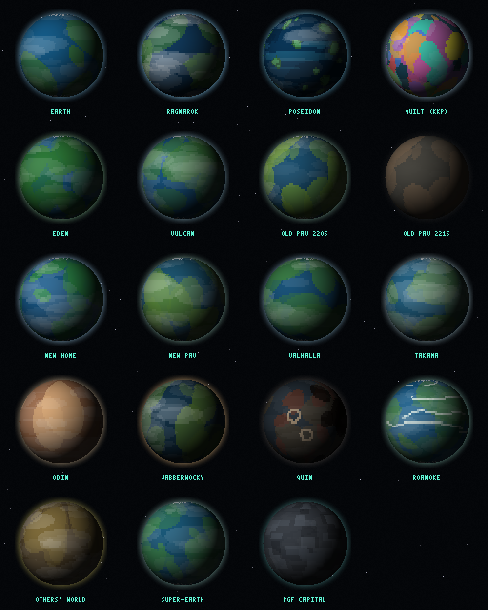

# Bobiverse Starmap — Tactical Explorer

An interactive 3D star map of the **Bobiverse** book series by Dennis E. Taylor — systems, planets, maiden-voyage routes, hostile Others incursions, and timeline events from all five books, rendered as a single self-contained HTML file.

## Features

- **3D tactical starmap** (Three.js) with glow-sprite stars, a light-year grid centred on Sol, projected labels, and a selection reticle
- **24 systems, 45+ planets & moons, 29 routes** — including book 5 (Jabberwocky, Roanoke, the PGF Capital near Sagittarius A*)
- **Timeline 2133–2350** with autoplay: watch the Bobnet expand, the Others' crimson routes creep out of GL 877, Old Pav get harvested in 2210, and GL 877 go **nova in 2257**
- **Living worlds**: 19 special worlds with bespoke surfaces, from terraforming Ragnarok and the lit-up colony worlds to war-scarred Quin, the Others' contaminated homeworld, and gas giants like Odin, plus the Others' partial Dyson sphere that builds and dies on the timeline
- **Click any planet** to fly to it and follow it along its orbit, with a camera-side fill light so the visible hemisphere is always lit
- Search across systems, planets, and Bobs (diacritic-insensitive); telemetry sidebar with mission logs and jump-to navigation

## Controls

| Input | Action |
|---|---|
| Drag | Rotate |
| Right-drag / 2-finger | Pan |
| Scroll / pinch | Zoom |
| Click star or planet | Open telemetry + fly to |

## Running

Open `index.html`. That's it — no build step, no server required (Three.js and GSAP load from cdnjs).

For GitHub Pages: Settings → Pages → Deploy from branch → `main` / root.

## Attribution & licenses

- Rebuilt from and inspired by [sgtriz/bobiverse-stars](https://github.com/sgtriz/bobiverse-stars) (MIT)
- Star, planet, route & Bob data derived from the [Bobiverse Fandom Wiki](https://bobiverse.fandom.com) under **CC BY-SA**; some coordinates estimated where the books name no real star (Jabberwocky, the core-side PGF systems)
- The Bobiverse series © Dennis E. Taylor — this is an unaffiliated fan project

Code: MIT (see LICENSE).
